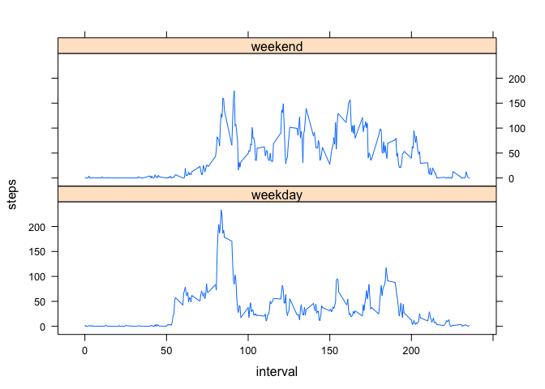

# Reproducible Research: Peer Assessment 1


## Loading and preprocessing the data

First we're unzipping the data file, because the downloadable file is in the zip format


```r
unzip("activity.zip")
```

Now we're loading the data into variable named "active"


```r
active <- read.csv("activity.csv", header=TRUE, sep=",")
```

It's necessary to conver the date variable to Date format:


```r
active$date <- as.Date(active$date)
```

Now get the basic sense of the data we're going to present the summary of it


```r
head(active)
```

```
##   steps       date interval
## 1    NA 2012-10-01        0
## 2    NA 2012-10-01        5
## 3    NA 2012-10-01       10
## 4    NA 2012-10-01       15
## 5    NA 2012-10-01       20
## 6    NA 2012-10-01       25
```

```r
summary(active)
```

```
##      steps             date               interval     
##  Min.   :  0.00   Min.   :2012-10-01   Min.   :   0.0  
##  1st Qu.:  0.00   1st Qu.:2012-10-16   1st Qu.: 588.8  
##  Median :  0.00   Median :2012-10-31   Median :1177.5  
##  Mean   : 37.38   Mean   :2012-10-31   Mean   :1177.5  
##  3rd Qu.: 12.00   3rd Qu.:2012-11-15   3rd Qu.:1766.2  
##  Max.   :806.00   Max.   :2012-11-30   Max.   :2355.0  
##  NA's   :2304
```

## What is mean total number of steps taken per day?

For this part of the analysis the we are ignoring the missing data.
First of all, we are summing the steps taken by each day


```r
sumByDay <- tapply(active$steps, active$date, sum)
```

Now we are making a histogram of the total number of steps taken each day


```r
hist(sumByDay, main="total number of steps taken each day", 
     xlab="steps each day")
```

 

Calculating the mean and the median total number of steps taken per day


```r
summar <- summary(sumByDay)
summar[3]
```

```
## Median 
##  10760
```

```r
summar[4]
```

```
##  Mean 
## 10770
```

## What is the average daily activity pattern?

Calculating the average number of steps by interval:


```r
aveByInter <- tapply(active$steps, active$interval, mean, na.rm=TRUE)
```

Now we are making the time series plot of the 5-minute interval and the average number 
of steps taken, averaged across all days:


```r
plot(aveByInter, type="l", main="Average number of steps by 5 min interval",
     ylab="averaged number of steps", xlab="time intervals")
```

 

Now we calculate which 5-minute interval, on average across all the days in the dataset 
cantains the maximum number of steps:


```r
max <- aveByInter[which.max(aveByInter)]
max
```

```
##      835 
## 206.1698
```

The 5-minute interval that has the maximum number of steps on average is 835.  

## Imputing missing values

In this part we are calculating the total number of missing values in the dataset


```r
missing <- sum(is.na(active))
```

The number of missing values in the dataset is 2304.

Now we're going to fill missing values. To do this we are using very simple strategy.
We are using the mean for particular 5 minute interval. To do this we will use the 
aveByInter variable, that we've calculated before.


```r
aveByInter <- as.data.frame(aveByInter)
for(i in 1:length(active$steps)) {
        if(is.na(active$steps[i])) {
                active$steps[i] = as.numeric(aveByInter[i,])
        }
}
```

Now we are making a histogram of the total number of steps taken each day with filled 
missing values. For this we're calculating the sum of steps by day:


```r
sumByDayFull <- tapply(active$steps, active$date, sum)
```

Now we are making the histogram.


```r
hist(sumByDayFull, main="Total number of steps taken each day (filled NA's)", 
     xlab="steps each day")
```

 

Calculating and presenting mean and median values.


```r
summaryFull <- summary(sumByDayFull)
summaryFull[3]
```

```
## Median 
##  10770
```

```r
summaryFull[4]
```

```
##  Mean 
## 10770
```

Above values of mean and median differ from values calculated from the dataset in which 
we ignored the missing values. The difference is relatively small. Therefore the 
impact of imputing missing data on the estimates of of the total daily number of steps 
is also relatively small.

## Are there differences in activity patterns between weekdays and weekends?

We are creating a new factor variable in the dataset with two levels:
1) weekday and 2) weekend indicating whether a given day is a weekday or weekend day. 


```r
weekend <- weekdays(active$date) == "Saturday" | weekdays(active$date) == "Sunday"
active$dayType[weekend] <- "weekend"
active$dayType[!weekend] <- "weekday"
active$dayType <- as.factor(active$dayType)
```

Now we are making a panel plot with the activity on weekend vs on weekdays.


```r
library(lattice)

aveStepInt <- aggregate(active$steps, by=list(active$interval, active$dayType), 
                        mean, na.rm=TRUE)
names(aveStepInt) <- c("interval", "dayType", "steps")

xyplot(steps ~ interval/10 | dayType, data=aveStepInt, type="l", layout=c(1,2),
       xlab="interval")
```

 

As we can see from above, the activity pattern differs in weekend and weekdays. 
On weekends the activity is smoother but higher during the day. On weekdays the 
activity starts a little bit eariler and on the morning it's more intense while during 
the day it's much lower. 
